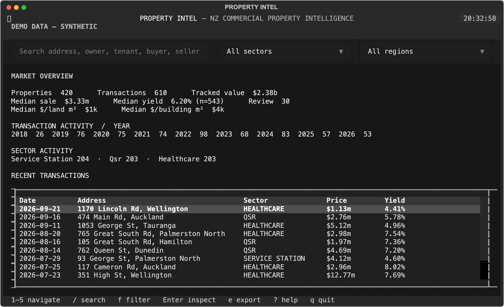
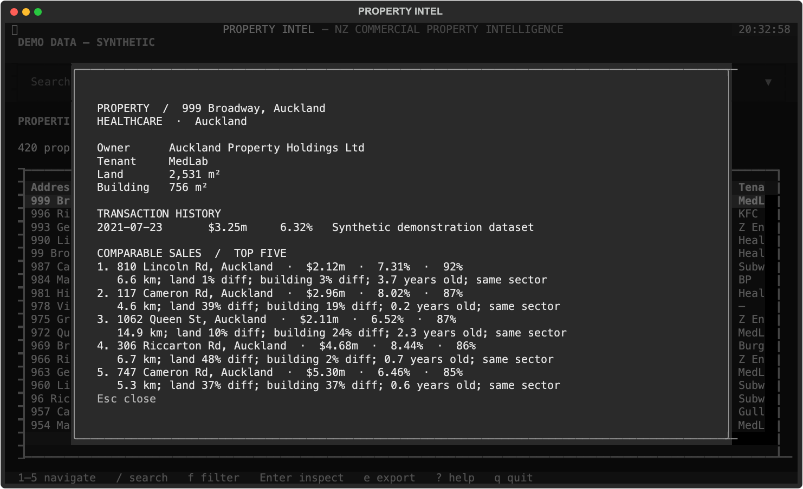
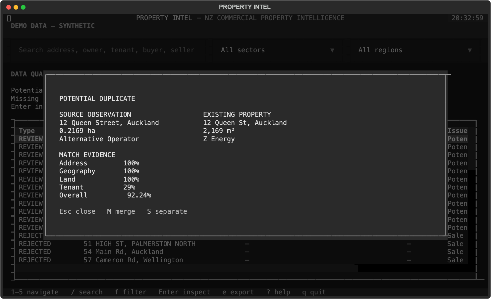
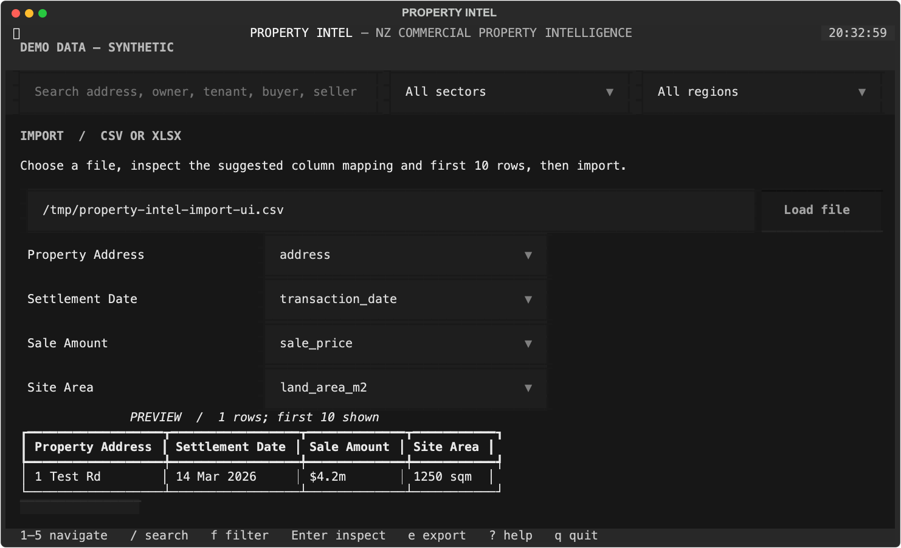
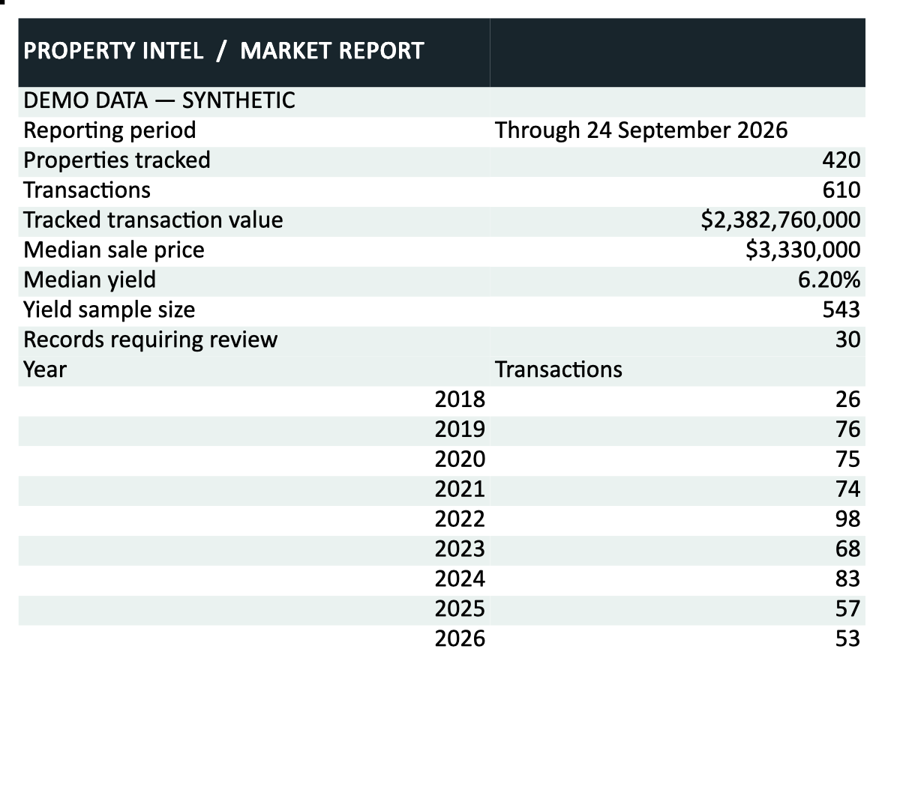
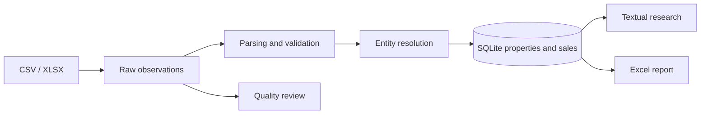

# Property Intel

**Terminal-native market intelligence for New Zealand commercial property research.**

Property Intel turns messy CSV/XLSX transactions into a searchable local property database with explainable duplicate review, comparable sales and a five-sheet Excel report.

> **Demo data is synthetic.** It exercises the pipeline and does not represent actual New Zealand market statistics or coverage.



`CSV/XLSX → raw observations → normalise → validate → resolve → SQLite → research → Excel`

## Run

```bash
uv sync
uv run property-intel --demo
```

No API key or external database is needed. The demo seed is deterministic and only runs when the selected database is empty.

```bash
uv run property-intel
uv run property-intel import path/to/sales.csv
uv run property-intel import path/to/sales.xlsx
uv run property-intel export --output report.xlsx
uv run property-intel --db /path/to/research.db
```

The default database is `data/property_intel.db`. Set `PROPERTY_INTEL_DB` or use `--db` to override it.

## Workstation

Use `1`–`5` for Overview, Transactions, Properties, Quality and Import. `/` opens global search; `f` reveals date, price and yield filters; Enter inspects a selected row; `e` exports; `?` shows help. The footer shows the common shortcuts. Press Esc to close a detail view or clear a search.



Property detail shows the source-backed transaction history and five comparable sales. Comparable ranking uses sector, geographic distance, land and building area, and sale recency. Each result includes those signals so the ranking can be checked.



Quality review preserves every incoming raw row. A candidate score at or above 93% matches automatically; 75–93% enters the review queue. Street-number, unit and postcode conflicts block automatic merging. Merge and Separate update the database.



Import previews ten rows and suggests column mappings. Correct a mapping before committing. Invalid rows remain as rejected raw observations with readable reasons.



## Data flow



The app uses SQLite and SQLAlchemy for a local analytical workload, Textual for dense keyboard navigation, RapidFuzz for explainable address similarity and openpyxl for downstream reporting. The five Excel sheets are Executive Summary, Transactions, Comparable Sales, Sector Analysis and Data Quality.

## Check

```bash
uv run pytest
uv run ruff check .
uv run mypy src
uv run python -m property_intel.evaluation
```

The labelled matching set is intentionally tiny and only protects known edge cases; its precision and recall are regression indicators, not population estimates. See [matching methodology](docs/entity-resolution.md), [analytics methodology](docs/methodology.md) and [architecture](docs/architecture.md).

The demo contains 420 canonical properties, 610 transactions and 760 raw observations across major New Zealand regions and three initial sectors. It includes address, currency, area and date variants, missing fields and deliberate errors. The figures, entities and transactions are invented.
